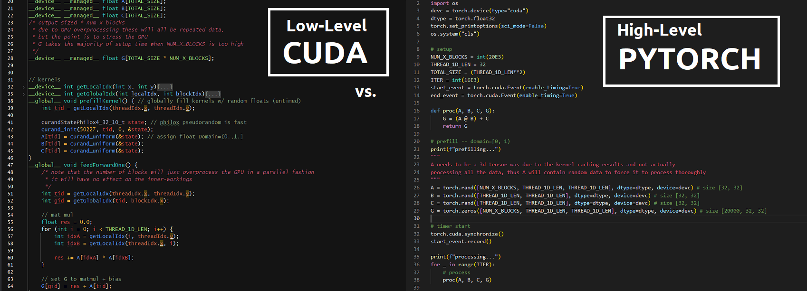
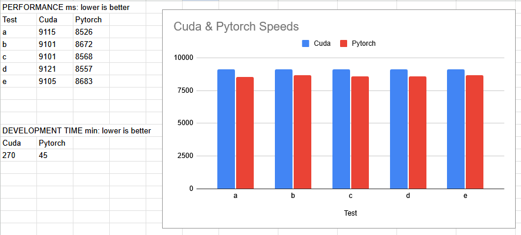

# Performance Cuda vs. Pytorch

Similar tests will be performed in Cuda and Pytorch in order to see if Cuda's performance gains are worth the cognitive overhead compared to Pytorch. Results at the bottom.

### PC setup
> - HOST: AMD Ryzen 5 3600, 32GB System Mem, MSI B450M Gaming Plus
> - GPU: Nvidia RTX 3090 Ti 24GB VRAM

### Notes
> - Both tests observed 100% GPU load for the majority of the stress.
> - Both scripts use slightly different timing mechanisms, so some amount of error should be given.

### The test
> Given:
> - A, B, C, are 2d arrays of 32x32
> - G is a flat or 3d array that can collect the full result (same flat size)
> 
> 16,000 iterations of:
> - 20,000 blocks of
>    - matrix multiplications A @ B
>    - G = (prev result) + C
> 
> The iterations serve as a sequential loader, and to visually confirm that the GPU load hits 100%.
> 20,000 block matrix multiplications and bias adders serve to emulate a neural network under stress.

## CUDA
### Interesting cuda compiler caching speedups
> 1. When the processing kernel does not feed to G (produces no output), a speedup from 9100ms to 615ms is observed. With no output actually being produced, the cuda compiler is taking a smart shortcut somewhere. Likely the kernel runs but is not performing any multiplications.
> 2. Normally within one single multiplication it must select the correct location of A and B to multiply-accumulate. If this is replaced with a fixed multiplication of .5 * .5 and then accumulated, there is some smart caching somewhere and a speedup from 9100ms to 1440ms is observed. This test contains an empty lookup for A and B in order to prove the speedup does not come from the lack of data lookups (in code), but caching of data.

### Non-optimized thread size
Thread size vs. memory useage matters but is also a pain to customize. Only a (32, 32) block size of threads was tested. Performance will reflect an unoptimized cuda kernel.

### Non-optimized unified memory
The Cuda test uses unified global memory instead of manually copying memory Host <-> Device. This could result in slowdowns.

## PYTORCH
### Smart Backend
> Interpretation of Cuda blocks will exist in Pytorch's Z dimension. In other words, Cuda's 20,000 blocks in the X direction will be translated to a depth dimension in Pytorch, giving a size of [20000, 32, 32], allowing this portion to also run in parallel. One snag was that Pytorch's backend is a dynamic graph system that heavily optimizes itself, so the A array had to also be a depth of 20000 like G in order to prevent it from caching results and shortcutting. More VRAM is expected to be used.

## RESULTS

This engineer-student concludes that Pytorch must contain some very smart backend optimizations! The results speak for themselves: Pytorch won in an arena where it was expected to lag behind some amount. What an underdog! If nobody on the development team in question has knowledge of Cuda hyper-niche optimization techniques then at worst, Pytorch performance losses would be negligible. Pytorch in this specific stress test surpasses naive Cuda code in performance by a negligible amount, and comes with blazing fast development time and comfort to the person sitting behind the keyboard.
